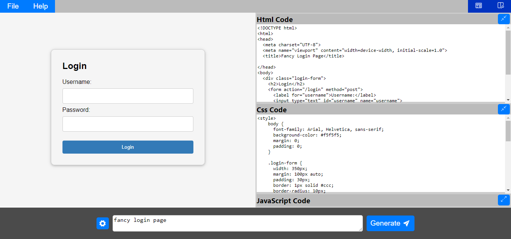

<h1 align="center">WebCraft</h1>

  
  

  Welcome to WebCraft, Web Page Code Generator and Integrated Development Environment (IDE)! 🚀

  This project leverages the power of AI to help users generate HTML, CSS, and JavaScript code for web pages effortlessly. With a simple prompt, the Generative AI model creates code snippets, making web development accessible to everyone.

## Overview

## Features

- **AI Integration:** Google's Generative AI model used to generate HTML, CSS, and JavaScript code based on user prompts.
- **Live Preview:** See a real-time preview of the generated code as you edit.
- **Error Handling:** Provides feedback and error messages if the AI model encounters any issues generating the code.

## How to Use

1. **Input Prompt:** Describe the web page you want to create. For example, "Create a simple landing page with a navigation bar and a hero section."
2. **Generate Code:** Click the "Generate" button to let the AI model generate the HTML, CSS, and JavaScript code based on your prompt.
3. **View Result:** The generated code will be displayed in the result section. You can copy the code to your clipboard using the "Copy Code" button.
4. **Edit and Preview:** Make adjustments and see the changes in real-time.

## Technologies Used

- **React.js**
- **Google Generative AI**

## Contribution

Thank you for checking out WebCraft! If you have any questions or feedback, please open an issue or reach out to us.
